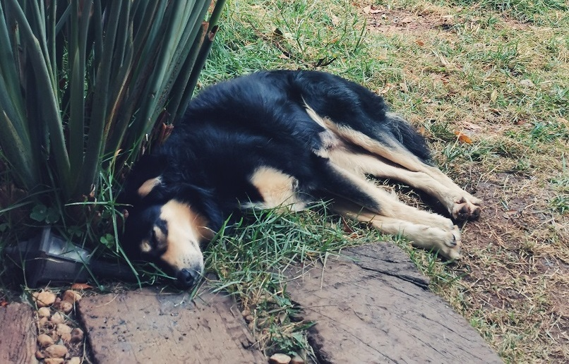

# Ironhack WDPT Project #1 - Memory Game

## Table of Contents
* [General Info](#general-information)
* [Game Rules](#game-rules)
* [Game Flow](#game-flow)
* [Game Over](#game-over)
* [Technologies Used](#tech)
* [Screenshots](#screenshots)
* [Setup](#setup)
* [Project Status](#project-status)
* [Room for Improvement](#room-for-improvement)
* [Acknowledgements](#acknowledgements)

## General Info

Memory game has long been a favorite game for all generations. It is easy to play, requires observation, concentration and a good memory to win. This game version is supposed to be played by a single player

## Game Rules
- The deck contains 12 cards in total with different food emojis
- Before the game start and the start of every round the cards are shuffled to appear in a random order
- The game starts after pressing the **START** button
- The moves counter and the countdown timer start counting with the start of the game
- The player has 40 seconds to complete the round
- The round can be resetted (started over) by clicking on the **RESET** button
- There is a maximum of 3 rounds per game as well as 3 resets in total
- The goal is to match all the 12 cards with the minimum amount of moves and the shortest time possible

## Game Flow
- Player clicks on **START**
- Player chooses 2 cards and tries to find 2 cards which are exactly the same
- If the player clickes on the card before clicking on **START**, a browser alert will be shown saying _"Please press the START button to start the game 🤗"_
- If the cards are a match, they will be kept flipped over
- If the cards are not a match, they will be flipped back again
- The game continues until all the the cards have been paired up
- If the countdown reached 0, and not all the cards have been flipped over, the round counts as lost
-  When the round is finished, the results will be displayed on the left hand-side, including the round number, the total time spent and the number of moves
-  In case the round was started over with the **RESET** button, a message _"Round number #... resetted"_ will be displayed
-  In case the player has run out of time, a message _"Round lost :("_ will be displayed
-  After 3 rounds played, the round with the best results will be displayed: _"The round with the best results: round #... with ... moves under ... seconds"_ 
-  By the same number of moves, the shortest time will be considered and the following message will be displayed: _"There is more than one round with the best results: round #... and round #... with ... moves under ... seconds"_
-  If no round was played (only lost or resetted), the game is considered **lost** and the following message will be displayed _"Game lost. Please try again 😉"_

## Game Over
The game is considered to be over when the maximum number of 3 rounds is achieved or no round was played.
 
## Technologies Used

HTML, CSS and JavaScript

## Screenshots
Start Screen

Round Complete

Round resetted

Round Lost

Best Round - different moves number

Best Round - same moves & different time

Best Round - same moves & same time

Maximum Number of Resets Reached

Game Over

Game Lost

## Setup
No special setup required

## Project Status
Project is _complete_

## Room for Improvement
- Add responsive design
- Adjust the game for mobile screens
- Add difficulty levels by increasing the cards quantity and/or decreasing the timer
- Add multiplayer functionality

## Acknowledgements
- Many thanks to the Ironhack Lead Teacher [@Nilton de Freitas](https://github.com/oniltos) and the Teacher Assistant Felipe Osório for the support provided during the project development
- Thanks to my husband Bruno Busquet for tolerating the lack of attention 😁
- Special thanks to our dogs 🐶 Hope and Happy for keeping me warm when working on the project during chilly São Paulo mornings

